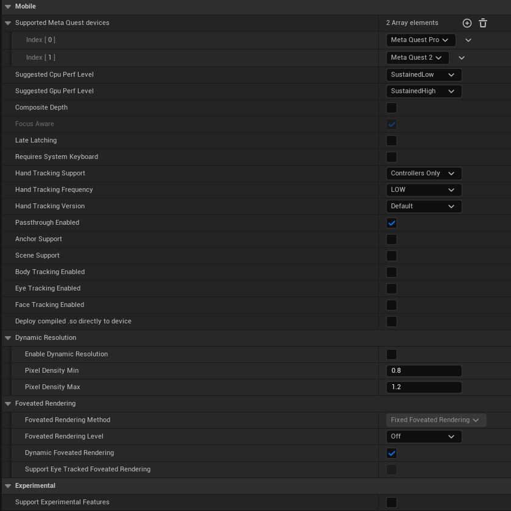

# Unreal-Quest3-PassthroughSample

This repository contains a sample Unreal Engine project demonstrating how to integrate and utilize the Passthrough, Depth API, and Mesh API for the latest Oculus Quest 3 device. This project serves as a reference for developers looking to create immersive Augmented Reality / Mixed Reality Experiences using Unreal Engine on the Oculus Quest 3 platform.

Table of Contents
- [Overview](#overview)
- [Getting Started](#getting-started)
  - [Prerequisites](#prerequisites)
  - [Installation](#installation)
- [Usage](#usage)
- [Contributing](#contributing)
- [License](#license)


# Overview
This sample project showcases the integration of Passthrough, Depth API, and Mesh API provided by Oculus for the Meta Quest 3 VR headset within the Unreal Engine 5.1.1 environment. It demonstrates how to access and utilize real-time camera feed (passthrough), depth information, and mesh data to create AR experiences in the Unreal Engine environment for Oculus Quest 3.

# Getting Started
Prerequisites
Before using this sample project, make sure you have the following prerequisites installed and set up:

# Prerequisites
Unreal Engine (version 5.1.1 or later)
Oculus Integration Plugin for Unreal Engine
Meta Quest 3 device
Meta Developer Account

# Installation
1. Clone this repository to your local machine:

``` bash
git clone https://github.com/ayushanbhore/Unreal-Quest3-PassthroughSample.git
```
2. Open the project in Unreal Engine. Works Best with Unreal Engine 5.1.1 and later

3. Download the MetaXR Plugin for your Engine

   Preferably - 54.0 Version
``` bash
https://developer.oculus.com/downloads/package/unreal-engine-5-integration
```
4. Launch Unreal Engine and Set these settings in the Project Settings -> Plugins -> MetaXR -> Mobile Section
   
  

# Usage
Follow these steps to run the sample project and explore the integration of Passthrough, Depth API, and Mesh API:

1. Connect your Oculus Quest 3 device to your Development machine using a Link ( Link Cable Recommended over the Air Link).

2. Build and Deploy the project to your Oculus Quest 3 device using Unreal Engine.

3. Put on your Oculus Quest 3 headset and experience the augmented reality environment created using Passthrough.

# License
This sample project is licensed under the MIT License. Feel free to modify and distribute it according to the terms of the license.

